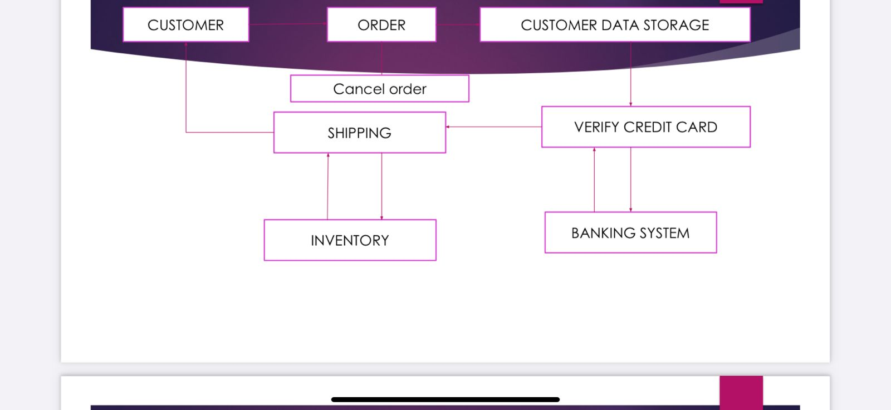
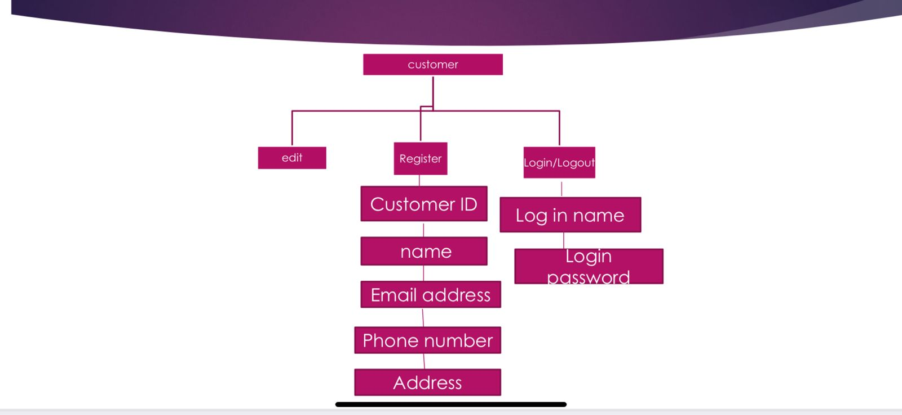
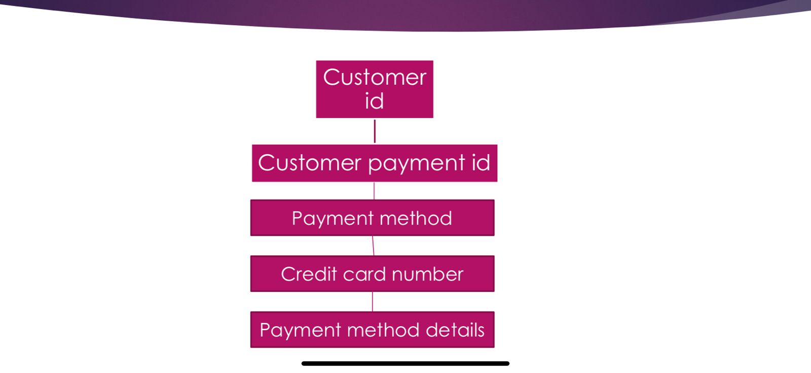

# BACHELOR OF SCIENCE INFORMATION TECHNOLOGY

# SCHOOL OF ENGINEERING AND TECHNOLOGY 

# SUPERVISOR

`DR.SUDESHNAR CHAKRABOTY`

# Group Members

1. Takondwa Zimulange
2. Brave Madeya
3. Edwin Visabwe
4. Semei Kibumba
5. Brain Kaamu

# Abstract 

- The purpose of the project is to help students  with their eating diet as it helps in health and  to do so many productive activities on a daily basis.

- This project will help students set their easting habits and hopefully achieve their goals.


# Motivation:

- The motivation of the project has come from the rise of unbalanced diets and lack of information of what’s health to take in and what’s not.

- Hence the students will know what to take and what not to according to their preference.

- This will be possible because the website will also share ingredients on how to make the food stuffs.


# Problem formulation/objectives:

- The objective is to show students there is more to health and eating habits.

- You never know small things like eating diets change peoples views towards new challenges in life hence completing them in a productive manner.


# Methodologies/planning of work:

- Our group consists of four members and we have planned to work together on this website which will cater to the students all over.

- The first step the student will log in or create an account to access everything on the website.

- Then he/she will be allowed to order anything available.

- I would have expanded this dialogue but I will explain it based on the data flow diagram on page 10.


# Facilities required for proposed work:

1. HTML
2. CSS
3. JAVASCRIPT
4. Python (Django - backend)
5. Postgresql (Database)

# DATA FLOW DIAGRAM



# 1st level DFD



# 2nd level DFD




# WHAT THE WEBSITE WILL DO:

- This website is for buying foodstuffs of every variety , vegetables of every type, grains ,daily products  meat even tasty sea food  from the deep blue oceans and many more.

- Apart from buying your daily needs , this website has more features to it. A customer can choose a specific diet to follow according to their needs. once the customer chooses their diet , we will deliver the raw materials and recipe for the meal.

- To access these features , the customer first has to create an account.
He or she then has to subscribe in order to purchase and access products and other features.

# HARDWARE:

```
RAM: 8GB
HDD: 250GB
PROCESSOR: intel i5 vpro
OS: linux
```

